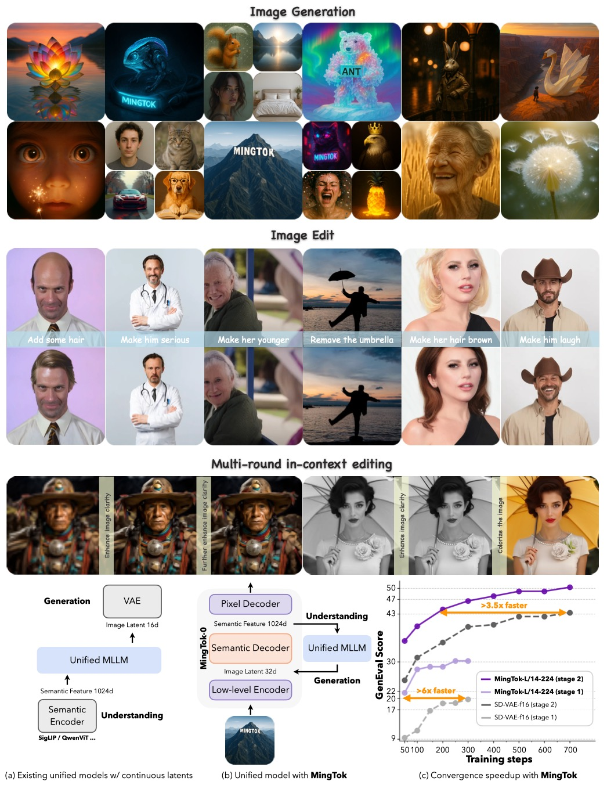

# Ming-UniVision: Joint Image Understanding and Geneation with a Continuous Unified Tokenizer

<p align="center">
    
<p>

<p align="center">📖<a href="https://inclusionai.github.io/blog/mingtok/">Project Page</a> ｜🤗 <a href="https://huggingface.co/inclusionAI/Ming-UniVision-16B-A3B">Hugging Face</a>｜ 🤖 <a href="https://www.modelscope.cn/models/inclusionAI/Ming-UniVision-16B-A3B">ModelScope</a>


## 🌍 Introduction

🌐 Ming-UniVision is a groundbreaking multimodal large language model (MLLM) that unifies vision understanding, generation, and editing within a single autoregressive next-token prediction (NTP) framework, powered by MingTok — the first continuous, unified visual tokenizer. By eliminating discrete quantization and leveraging a shared continuous latent space, Ming-UniVision enables seamless, end-to-end multimodal reasoning across diverse tasks.
Trained on high-fidelity continuous visual representations, Ming-UniVision supports multi-round, in-context vision-language interactions, such as iterative question answering, image generation, and semantic editing — all without needing to decode intermediate states into pixels. This enables efficient, coherent, and human-like multimodal dialogue with consistent feature dynamics throughout.

- 🌐 **First NTP MLLM with Continuous Unified Vision Representations**: [Ming-UniVision](https://huggingface.co/inclusionAI/Ming-UniVision-16B-A3B)
unifies vision and language via next-token prediction using continuous visual representations — no quantization, no modality-specific heads.
- 🖼️ **First Continuous Unified Visual Tokenizer:** [MingTok-Vision](https://huggingface.co/inclusionAI/MingTok-Vision)
enables both understanding and generation in a single continuous space, preserving semantic and perceptual quality.
- ⚡ **3.5× Faster Training Convergence:**
Shared representation reduces conflict between tasks, enabling faster, more stable joint training.
- 🔄 **Multi-Round In-Context Vision Tasks:**
Perform iterative reasoning, generation, and editing in one latent space — no image decoding needed mid-process.
- 🔗 **Single Space, Unified Workflow:**
All modalities and tasks share one coherent feature space — simpler training, efficient inference, true autoregressive fusion.


<p align="center">
    
<p>

## 📌 Updates

* [2025.10.02] 🔥 **We’re live!**
We’re thrilled to announce the release of Ming-UniVision and MingTok-Vision — the first joint autoregressive vision-language system with unified continuous visual tokenization!

✨ Enable seamless multimodal reasoning, generation, and editing in a single latent space.

🚀 Faster training, richer semantics, and true end-to-end autoregression — no quantization, no compromises.

👉 Check out our [blog post](https://inclusionai.github.io/blog/mingtok/) to learn how we’re redefining unified vision-language intelligence.


<!-- ## Key Features -->


<!-- <p align="center">
    
<p> -->

## 📊 Evaluation

MingTok-Vision achieves strong image reconstruction capability and Ming-UniVision enables unified multimodal understanding and generation within a single continuous latent space.

### Image Reconstruction 

MingTok-Vision achieves competitive reconstruction quality with high PSNR and low rFID, demonstrating its ability to preserve both perceptual fidelity and semantic structure in a continuous representation.
<style>
  body {
      font-family: Arial, sans-serif;
      margin: 20px;
    }
    table {
      width: 100%;
      border-collapse: collapse;
      font-size: 12px;
    }
    th, td {
      border: 1px solid #ccc;
      padding: 6px 8px;
      text-align: center;
    }
    thead th {
      background-color: transparent;
      font-weight: bold;
    }
    .section-row {
      background-color: transparent;
      text-align: center;
      font-style: italic;
    }
    .uparrow {
      font-size: 10px; vertical-align: super;
    }
    .dagger {
      font-size: 10px; color: gray;
    }
    caption {
      font-weight: bold;
      font-size: 14px;
      margin: 10px 0;
      text-align: left;
    }
</style>

<table>
  <caption>
    <strong>Table 1. Image reconstruction performance</strong> on ImageNet-val-50k.
  </caption>
  <thead>
    <tr>
      <th>Tokenizer</th>
      <th>Res.</th>
      <th># Tokens</th>
      <th>rFID ↓</th>
      <th>PSNR ↑</th>
      <th>SSIM ↑</th>
      <th>LPIPS ↓</th>
    </tr>
  </thead>
  <tbody>
    <!-- Specialized tokenizers -->
    <tr class="italic">
      <td colspan="7"><em>Specialized tokenizers</em></td>
    </tr>
    <tr>
      <td>SD-VAE</td>
      <td>256</td>
      <td>1024</td>
      <td>1.06</td>
      <td>28.62</td>
      <td>0.86</td>
      <td>-</td>
    </tr>
    <tr>
      <td>GigaTok</td>
      <td>256</td>
      <td>256</td>
      <td>0.51</td>
      <td>21.32</td>
      <td>0.69</td>
      <td>0.21</td>
    </tr>
    <tr>
      <td>VA-VAE</td>
      <td>256</td>
      <td>256</td>
      <td>0.26</td>
      <td>28.59</td>
      <td>0.80</td>
      <td>0.09</td>
    </tr>
    <tr>
      <td>HieraTok</td>
      <td>256</td>
      <td>256</td>
      <td>1.04</td>
      <td>23.90</td>
      <td>0.72</td>
      <td>0.09</td>
    </tr>
    <tr>
      <td>DC-AE</td>
      <td>512</td>
      <td>64</td>
      <td>0.22</td>
      <td>26.15</td>
      <td>0.71</td>
      <td>0.08</td>
    </tr>
    <tr>
      <td>MAE-Tok</td>
      <td>512</td>
      <td>128</td>
      <td>0.62</td>
      <td>-</td>
      <td>-</td>
      <td>-</td>
    </tr>
    <tr>
      <td>TexTok</td>
      <td>512</td>
      <td>256</td>
      <td>0.73</td>
      <td>24.45</td>
      <td>0.66</td>
      <td>0.19</td>
    </tr>
    <!-- Unified tokenizers -->
    <tr class="italic">
      <td colspan="7"><em>Unified tokenizers</em></td>
    </tr>
    <tr>
      <td>UniTok</td>
      <td>256</td>
      <td>256</td>
      <td>0.38</td>
      <td>-</td>
      <td>-</td>
      <td>-</td>
    </tr>
    <tr>
      <td>TokenFlow</td>
      <td>384</td>
      <td>729</td>
      <td>0.63</td>
      <td>22.77</td>
      <td>0.73</td>
      <td>-</td>
    </tr>
    <tr>
      <td><strong>MingTok-Vision</strong></td>
      <td>512</td>
      <td>256</td>
      <td>0.54</td>
      <td>30.77</td>
      <td>0.62</td>
      <td>0.14</td>
    </tr>
    <tr>
      <td><strong>MingTok-Vision</strong> †</td>
      <td>512</td>
      <td>256</td>
      <td>0.38</td>
      <td>31.09</td>
      <td>0.64</td>
      <td>0.12</td>
    </tr>
  </tbody>
</table>

<div class="footnote">
  <strong>†</strong> denotes using semantic decoder after joint pre-training.
</div>

<!DOCTYPE html>
<html lang="en">
<head>
  <meta charset="UTF-8" />
  <title>Quantitative Evaluations on Multimodal Benchmarks</title>
  <style>
    body {
      font-family: Arial, sans-serif;
      margin: 20px;
    }
    table {
      width: 100%;
      border-collapse: collapse;
      font-size: 12px;
    }
    th, td {
      border: 1px solid #ccc;
      padding: 6px 8px;
      text-align: center;
    }
    thead th {
      background-color: transparent;
      font-weight: bold;
    }
    .section-row {
      background-color: #f9f9f9;
      text-align: center;
      font-style: italic;
    }
    .dash-line {
      border-top: 1px dashed #aaa;
    }
    .uparrow {
      font-size: 10px; vertical-align: super;
    }
  </style>
</head>
<body>

### Visual Understanding
Ming-UniVision achieves competitive performance on multimodal understanding benchmarks, showing that continuous latent tokens can effectively support high-level vision-language reasoning without discrete quantization.
<table>
  <caption>
    <strong>Table 2. Quantitative evaluations</strong> on MMBench, MMStar, MMMU, MathVista, HallusionBench, AI2D, MM-Vet, OCRBench, and MME.
  </caption>
  <thead>
    <tr>
      <th>Model</th>
      <th>MMB&nbsp;<span class="uparrow">↑</span></th>
      <th>MMS&nbsp;<span class="uparrow">↑</span></th>
      <th>MMMU&nbsp;<span class="uparrow">↑</span></th>
      <th>MathV&nbsp;<span class="uparrow">↑</span></th>
      <th>Hall&nbsp;<span class="uparrow">↑</span></th>
      <th>AI2D&nbsp;<span class="uparrow">↑</span></th>
      <th>MM-Vet&nbsp;<span class="uparrow">↑</span></th>
      <th>OCRBench&nbsp;<span class="uparrow">↑</span></th>
      <th>MME&nbsp;<span class="uparrow">↑</span></th>
    </tr>
  </thead>
  <tbody>
    <!-- Understanding Only -->
    <tr class="section-row">
      <td colspan="10"><em>Understanding Only</em></td>
    </tr>
    <tr>
      <td>Emu3-Chat</td>
      <td>58.5</td>
      <td>-</td>
      <td>31.6</td>
      <td>-</td>
      <td>-</td>
      <td>-</td>
      <td>37.2</td>
      <td>687</td>
      <td>-</td>
    </tr>
    <tr>
      <td>Qwen2.5-VL-3B</td>
      <td>79.1</td>
      <td>55.9</td>
      <td>53.1</td>
      <td>62.3</td>
      <td>46.3</td>
      <td>81.6</td>
      <td>-</td>
      <td>797</td>
      <td>2157</td>
    </tr>
    <tr>
      <td>Qwen2.5-VL-7B</td>
      <td>83.5</td>
      <td>63.9</td>
      <td>58.6</td>
      <td>68.2</td>
      <td>52.9</td>
      <td>83.9</td>
      <td>67.1</td>
      <td>864</td>
      <td>2347</td>
    </tr>
    <tr>
      <td>InternVL2.5-4B</td>
      <td>81.1</td>
      <td>58.3</td>
      <td>52.3</td>
      <td>60.5</td>
      <td>46.3</td>
      <td>81.4</td>
      <td>60.6</td>
      <td>828</td>
      <td>2338</td>
    </tr>
    <tr>
      <td>InternVL2.5-8B</td>
      <td>84.6</td>
      <td>62.8</td>
      <td>56.0</td>
      <td>64.4</td>
      <td>50.1</td>
      <td>84.5</td>
      <td>62.8</td>
      <td>822</td>
      <td>2344</td>
    </tr>
    <tr>
      <td>DeepSeek-VL2</td>
      <td>79.6</td>
      <td>61.3</td>
      <td>51.1</td>
      <td>62.8</td>
      <td>-</td>
      <td>81.4</td>
      <td>-</td>
      <td>811</td>
      <td>2253</td>
    </tr>
    <!-- Unified model, Separate representation -->
    <tr class="section-row">
      <td colspan="10"><em>Unified model, Separate representation</em></td>
    </tr>
    <tr>
      <td>Janus-Pro-7B</td>
      <td>79.2</td>
      <td>-</td>
      <td>41.0</td>
      <td>-</td>
      <td>-</td>
      <td>-</td>
      <td>50.0</td>
      <td>-</td>
      <td>-</td>
    </tr>
    <tr>
      <td>LMFusion</td>
      <td>-</td>
      <td>-</td>
      <td>41.7</td>
      <td>-</td>
      <td>-</td>
      <td>-</td>
      <td>-</td>
      <td>-</td>
      <td>1603</td>
    </tr>
    <tr>
      <td>MetaQuery-L</td>
      <td>78.6</td>
      <td>-</td>
      <td>53.1</td>
      <td>-</td>
      <td>-</td>
      <td>-</td>
      <td>63.2</td>
      <td>-</td>
      <td>-</td>
    </tr>
    <tr>
      <td>Show-o2-7B</td>
      <td>79.3</td>
      <td>56.6</td>
      <td>48.9</td>
      <td>-</td>
      <td>-</td>
      <td>78.6</td>
      <td>-</td>
      <td>-</td>
      <td>-</td>
    </tr>
    <tr>
      <td>BLIP3-o 4B</td>
      <td>78.6</td>
      <td>-</td>
      <td>46.6</td>
      <td>-</td>
      <td>-</td>
      <td>-</td>
      <td>60.1</td>
      <td>-</td>
      <td>2161</td>
    </tr>
    <tr>
      <td>BAGEL</td>
      <td>85.0</td>
      <td>-</td>
      <td>55.3</td>
      <td>73.1</td>
      <td>-</td>
      <td>-</td>
      <td>67.2</td>
      <td>-</td>
      <td>2388</td>
    </tr>
    <!-- Unified model, Unified representation -->
    <tr class="section-row">
      <td colspan="10"><em>Unified model, Unified representation</em></td>
    </tr>
    <tr>
      <td>VILA-U</td>
      <td>-</td>
      <td>-</td>
      <td>-</td>
      <td>-</td>
      <td>-</td>
      <td>-</td>
      <td>33.5</td>
      <td>-</td>
      <td>1402</td>
    </tr>
    <tr>
      <td>TokenFlow-XL</td>
      <td>76.8</td>
      <td>-</td>
      <td>43.2</td>
      <td>-</td>
      <td>-</td>
      <td>-</td>
      <td>48.2</td>
      <td>-</td>
      <td>1922</td>
    </tr>
    <tr>
      <td>UniTok</td>
      <td>-</td>
      <td>-</td>
      <td>-</td>
      <td>-</td>
      <td>-</td>
      <td>-</td>
      <td>33.9</td>
      <td>-</td>
      <td>1448</td>
    </tr>
    <tr>
      <td>Harmon-1.5B</td>
      <td>65.5</td>
      <td>-</td>
      <td>38.9</td>
      <td>-</td>
      <td>-</td>
      <td>-</td>
      <td>-</td>
      <td>-</td>
      <td>1476</td>
    </tr>
    <tr>
      <td>TokLIP</td>
      <td>67.6</td>
      <td>-</td>
      <td>43.1</td>
      <td>-</td>
      <td>-</td>
      <td>-</td>
      <td>29.8</td>
      <td>-</td>
      <td>-</td>
    </tr>
    <!-- Dashed line separator -->
    <tr><td colspan="10" style="border-top: 1px dashed #aaa;"></td></tr>
    <!-- Ours -->
    <tr>
      <td><strong>Ming-UniVision-16B-A3B (Ours)</strong></td>
      <td>78.5</td>
      <td>63.7</td>
      <td>40.3</td>
      <td>66.6</td>
      <td>47.8</td>
      <td>82.8</td>
      <td>64.2</td>
      <td>724</td>
      <td>2023</td>
    </tr>
  </tbody>
</table>

</body>
</html>

### Visual Generation

Ming-UniVision achieves top performance among unified representation models in text-to-image generation, demonstrating superior object composition and spatial reasoning capabilities.

<!DOCTYPE html>
<html lang="en">
<head>
  <meta charset="UTF-8" />
  <title>Text-to-Image Generation Evaluation</title>
  <style>
    body {
      font-family: Arial, sans-serif;
      margin: 20px;
    }
    table {
      width: 100%;
      border-collapse: collapse;
      font-size: 12px;
    }
    th, td {
      border: 1px solid #ccc;
      padding: 6px 8px;
      text-align: center;
    }
    thead th {
      background-color: transparent;
      font-weight: bold;
    }
    .section-row {
      background-color: transparent;
      text-align: center;
      font-style: italic;
    }
    .uparrow {
      font-size: 10px; vertical-align: super;
    }
    .dagger {
      font-size: 10px; color: gray;
    }
    caption {
      font-weight: bold;
      font-size: 14px;
      margin: 10px 0;
      text-align: left;
    }
  </style>
</head>
<body>

<table>
  <caption>
    <strong>Table 3. Evaluation of text-to-image generation ability</strong> on GenEval and DPG-Bench.
    <span class="dagger">† denotes performance obtained by rewritten prompts.</span>
  </caption>
  <thead>
    <tr>
      <th>Method</th>
      <th>Single Obj.&nbsp;<span class="uparrow">↑</span></th>
      <th>Two Obj.&nbsp;<span class="uparrow">↑</span></th>
      <th>Counting&nbsp;<span class="uparrow">↑</span></th>
      <th>Colors&nbsp;<span class="uparrow">↑</span></th>
      <th>Position&nbsp;<span class="uparrow">↑</span></th>
      <th>Color Attri.&nbsp;<span class="uparrow">↑</span></th>
      <th>Overall&nbsp;<span class="uparrow">↑</span></th>
      <th>DPG-Bench&nbsp;<span class="uparrow">↑</span></th>
    </tr>
  </thead>
  <tbody>
    <!-- Generation Only -->
    <tr class="section-row">
      <td colspan="9"><em>Generation Only</em></td>
    </tr>
    <tr>
      <td>LlamaGen</td>
      <td>0.71</td>
      <td>0.34</td>
      <td>0.21</td>
      <td>0.58</td>
      <td>0.07</td>
      <td>0.04</td>
      <td>0.32</td>
      <td>-</td>
    </tr>
    <tr>
      <td>PixArt-α</td>
      <td>0.98</td>
      <td>0.50</td>
      <td>0.44</td>
      <td>0.80</td>
      <td>0.08</td>
      <td>0.07</td>
      <td>0.48</td>
      <td>-</td>
    </tr>
    <tr>
      <td>SDv2.1</td>
      <td>0.98</td>
      <td>0.51</td>
      <td>0.44</td>
      <td>0.85</td>
      <td>0.07</td>
      <td>0.17</td>
      <td>0.50</td>
      <td>-</td>
    </tr>
    <tr>
      <td>DALL-E 2</td>
      <td>0.94</td>
      <td>0.66</td>
      <td>0.49</td>
      <td>0.77</td>
      <td>0.10</td>
      <td>0.19</td>
      <td>0.52</td>
      <td>-</td>
    </tr>
    <tr>
      <td>Emu3-Gen</td>
      <td>0.98</td>
      <td>0.71</td>
      <td>0.34</td>
      <td>0.81</td>
      <td>0.17</td>
      <td>0.21</td>
      <td>0.54</td>
      <td>80.60</td>
    </tr>
    <tr>
      <td>SDXL</td>
      <td>0.98</td>
      <td>0.74</td>
      <td>0.39</td>
      <td>0.85</td>
      <td>0.15</td>
      <td>0.23</td>
      <td>0.55</td>
      <td>74.65</td>
    </tr>
    <tr>
      <td>DALL-E 3</td>
      <td>0.96</td>
      <td>0.87</td>
      <td>0.47</td>
      <td>0.83</td>
      <td>0.43</td>
      <td>0.45</td>
      <td>0.67</td>
      <td>83.50</td>
    </tr>
    <tr>
      <td>SD3-Medium</td>
      <td>0.99</td>
      <td><strong>0.94</strong></td>
      <td>0.72</td>
      <td>0.89</td>
      <td>0.33</td>
      <td>0.60</td>
      <td>0.74</td>
      <td>84.08</td>
    </tr>
    <!-- Unified model, Separate representation -->
    <tr class="section-row">
      <td colspan="9"><em>Unified model, Separate representation</em></td>
    </tr>
    <tr>
      <td>Show-o</td>
      <td>0.95</td>
      <td>0.52</td>
      <td>0.49</td>
      <td>0.82</td>
      <td>0.11</td>
      <td>0.28</td>
      <td>0.53</td>
      <td>-</td>
    </tr>
    <tr>
      <td>Ming-Lite-Uni</td>
      <td>0.99</td>
      <td>0.76</td>
      <td>0.53</td>
      <td>0.87</td>
      <td>0.26</td>
      <td>0.30</td>
      <td>0.62</td>
      <td>-</td>
    </tr>
    <tr>
      <td>Janus-Pro-1B</td>
      <td>0.98</td>
      <td>0.82</td>
      <td>0.51</td>
      <td>0.89</td>
      <td>0.65</td>
      <td>0.56</td>
      <td>0.73</td>
      <td>82.63</td>
    </tr>
    <tr>
      <td>Janus-Pro-7B</td>
      <td>0.99</td>
      <td>0.89</td>
      <td>0.59</td>
      <td>0.90</td>
      <td>0.79</td>
      <td>0.66</td>
      <td>0.80</td>
      <td>84.19</td>
    </tr>
    <tr>
      <td>Show-o2-7B</td>
      <td><strong>1.00</strong></td>
      <td>0.87</td>
      <td>0.58</td>
      <td>0.92</td>
      <td>0.52</td>
      <td>0.62</td>
      <td>0.76</td>
      <td><strong>86.14</strong></td>
    </tr>
    <tr>
      <td>MetaQuery-L†</td>
      <td>-</td>
      <td>-</td>
      <td>-</td>
      <td>-</td>
      <td>-</td>
      <td>-</td>
      <td>0.78</td>
      <td>81.10</td>
    </tr>
    <tr>
      <td>Blip3-o 4B</td>
      <td>-</td>
      <td>-</td>
      <td>-</td>
      <td>-</td>
      <td>-</td>
      <td>-</td>
      <td>0.81</td>
      <td>79.36</td>
    </tr>
    <tr>
      <td>BAGEL</td>
      <td>0.99</td>
      <td><strong>0.94</strong></td>
      <td><strong>0.81</strong></td>
      <td>0.88</td>
      <td>0.64</td>
      <td>0.63</td>
      <td>0.82</td>
      <td>-</td>
    </tr>
    <!-- Unified model, Unified representation -->
    <tr class="section-row">
      <td colspan="9"><em>Unified model, Unified representation</em></td>
    </tr>
    <tr>
      <td>Harmon-1.5B</td>
      <td>0.99</td>
      <td>0.86</td>
      <td>0.66</td>
      <td>0.85</td>
      <td>0.74</td>
      <td>0.48</td>
      <td>0.79</td>
      <td>-</td>
    </tr>
    <tr>
      <td>TokenFlow-XL</td>
      <td>0.95</td>
      <td>0.60</td>
      <td>0.41</td>
      <td>0.81</td>
      <td>0.16</td>
      <td>0.24</td>
      <td>0.55</td>
      <td>73.38</td>
    </tr>
    <!-- Dashed line separator -->
    <tr><td colspan="9" style="border-top: 1px dashed #aaa;"></td></tr>
    <!-- Ours -->
    <tr>
      <td><strong>Ming-UniVision-16B-A3B (Ours)</strong></td>
      <td><strong>1.00</strong></td>
      <td>0.93</td>
      <td>0.59</td>
      <td><strong>0.93</strong></td>
      <td><strong>0.92</strong></td>
      <td><strong>0.70</strong></td>
      <td><strong>0.85</strong></td>
      <td>82.12</td>
    </tr>
  </tbody>
</table>

</body>
</html>

## 📥 Model Downloads

| Model | Hugging Face | ModelScope |
|-------|--------------|------------|
| **Ming-UniVision-16B-A3B** | [Download](https://huggingface.co/inclusionAI/Ming-UniVision-16B-A3B) | [Download](https://www.modelscope.cn/models/inclusionAI/Ming-UniVision-16B-A3B) |
| **MingTok-Vision** | [Download](https://huggingface.co/inclusionAI/MingTok-Vision) | [Download](https://www.modelscope.cn/models/inclusionAI/MingTok-Vision) |

> 🔗 Both models are publicly available for research. Visit the respective pages for model details, inference examples, and integration guides.

## 🚀 Example Usage

### 🔧 Installation

First, clone the repository and install the required dependencies:

```bash
pip install -r requirements.txt
git clone https://github.com/inclusionAI/Ming-UniVision.git
cd Ming-UniVision
```

### 🖼️ Image Reconstruction with MingTok-Vision
Here's a simple demo to reconstruct an image using the continuous latent space of MingTok-Vision:
```python
# test_infer_recon_image.py
import torch
from PIL import Image
import torchvision.transforms as T
from omegaconf import OmegaConf
from mingtok.modeling_mingtok import MingTok
from mingtok.utils import CenterCropProcessor

if __name__ == "__main__":
    # Load model
    mingtok_model = MingTok.from_pretrained("inclusionAI/MingTok-Vision")
    mingtok_model = mingtok_model.cuda()

    img_path = "mingtok/asset/mingtok.png"
    save_path = "mingtok/asset/mingtok_recon.png"

    # Load and preprocess image
    image = Image.open(img_path).convert("RGB")
    processor = CenterCropProcessor(image_size=512, mean=[0.5, 0.5, 0.5], std=[0.5, 0.5, 0.5])
    image = processor(image).cuda().unsqueeze(0)

    # Reconstruct
    out = mingtok_model.forward_enc_dec(image)

    # Denormalize and save
    output_mean = torch.Tensor([0.5, 0.5, 0.5]).view(1, -1, 1, 1).cuda()
    output_std = torch.Tensor([0.5, 0.5, 0.5]).view(1, -1, 1, 1).cuda()
    output_image = (out * output_std + output_mean)[0]
    output_image = T.ToPILImage()(output_image)
    output_image.save(save_path)
    print(f"Reconstructed image saved to {save_path}")
```

### 💬 Multi-Modal Inference with Ming-UniVision
Use MingUniVisionInfer for unified tasks including text-to-image generation, image captioning, and visual question answering.

```python
from mingunivisioninfer import MingUniVisionInfer, tensor_to_pil

# Initialize model
model = MingUniVisionInfer("inclusionAI/Ming-UniVision-16B-A3B")

# Text-to-image generation
image_gen_prompt = "A beautiful girl."
messages = [{
    "role": "HUMAN",
    "content": [{"type": "text", "text": image_gen_prompt}],
}]

img_tensor = model.generate(
    messages,
    max_new_tokens=512,
    image_gen=True,
    image_gen_prompt=image_gen_prompt,
    image_gen_height=512,
    image_gen_width=512
)
pil_img = tensor_to_pil(img_tensor)
pil_img.save("a_beautiful_girl.jpg")
print("Generated image saved as 'a_beautiful_girl.jpg'")

# image captioning
messages = [{
    "role": "HUMAN",
    "content": [
        {"type": "image", "image": "a_beautiful_girl.jpg"},
        {"type": "text", "text": "Please describe the picture."},
    ],
}]

output_text = model.generate(messages, max_new_tokens=512)
print("Caption:", output_text)

# text-only question answering
messages = [{
    "role": "HUMAN",
    "content": [
        {"type": "text", "text": "请详细介绍鹦鹉的习性。"},
    ],
}]

output_text = model.generate(messages, max_new_tokens=512)
print("Answer:", output_text)
```


📌 Tips:
- Set image_gen=True when generating images.
- Supported input types: "text" and "image" in message list.
- The model supports multi-round conversations by appending previous history to messages.

Note: We test the examples on hardware of NVIDIA H800-80GB/H20-96G with CUDA 12.4.


## ✍️ Citation

If you find our work useful in your research or applications, please consider citing:
```
TBD
```

